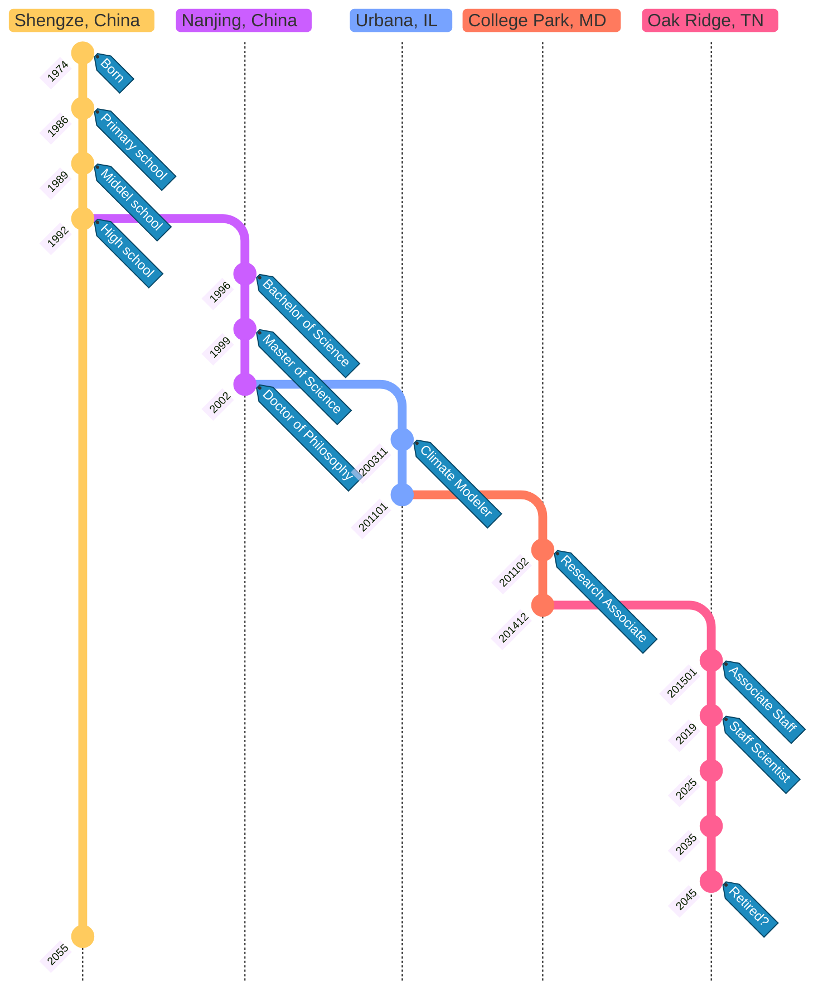
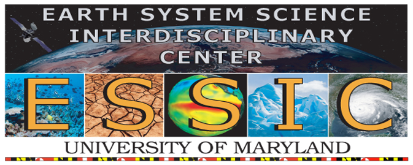
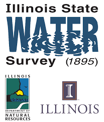

I was born in a small town called Shengze, which is located in southeastern China and is part of Suzhou, Jiangsu Province.
My hometown is well-known as the land of silk and the land of fish and rice.

My education and employee time line is as follows:

=== "Oak Ridge, TN"

    { align=right width=108 }

    [Computational Sciences and Engineering Division](https://www.ornl.gov/division/csed), [Oak Ridge National Laboratory](https://www.ornl.gov)

=== "College Park, MD"

    { align=right width=108 }

    [Earth System Science Interdisciplinary Center](https://essic.umd.edu), [University of Maryand at College Park](https://umd.edu)

=== "Urbana, IL"

    { align=right width=88 }

    [Illinois State Water Survey](https://isws.illinois.edu), [University of Illinois at Urbana and Champaign](https://www.illinois.edu)

=== "Nanjing, China"

     { align=right width=88 }

     [Department of Atmospheric Sciences](https://as.nju.edu.cn), [Nanjing University](https://www.nju.edu.cn)

     :   Bachelor, major in Atmospheric Physics and Minor Electronic Engineering
     :   Master in Atmospheric Physics
     :   Ph.D. in Atmospheric Sciences

=== "Shengze, China"

     Shengze Renminjie Primary School

     Shengze Second Middle School

     Shengze High School

     

