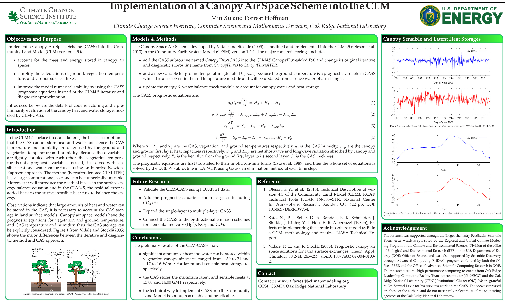
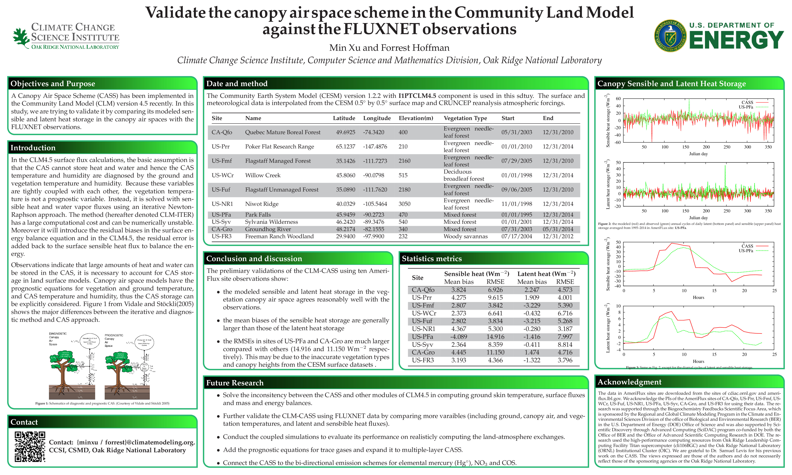
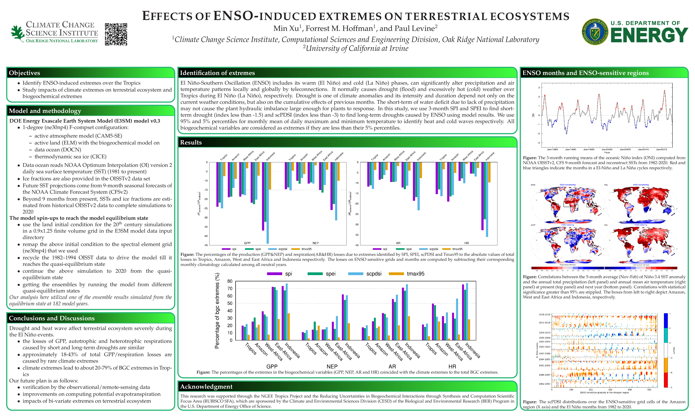
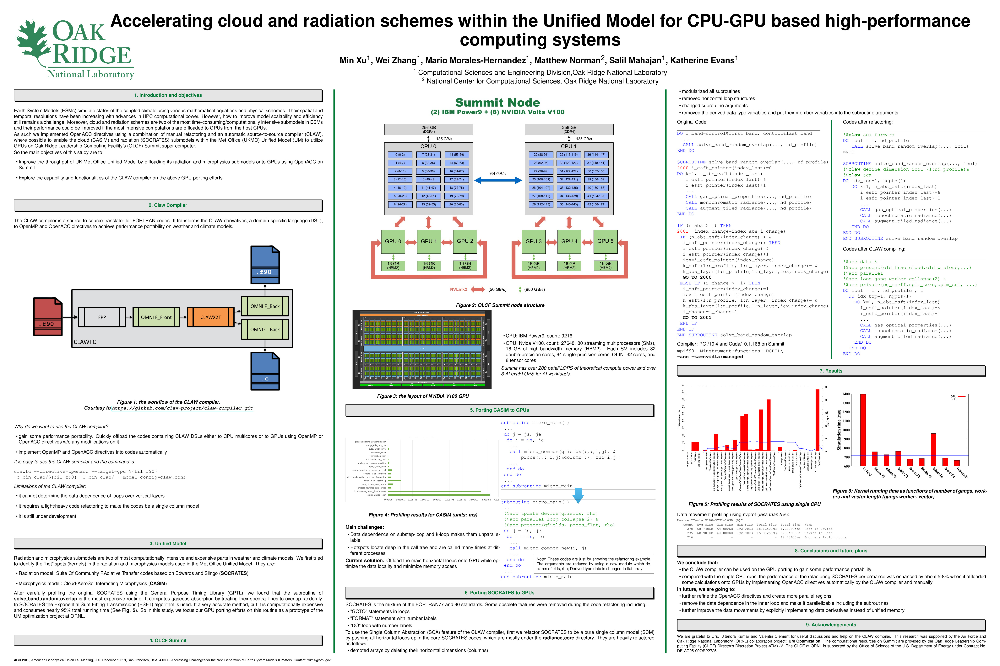
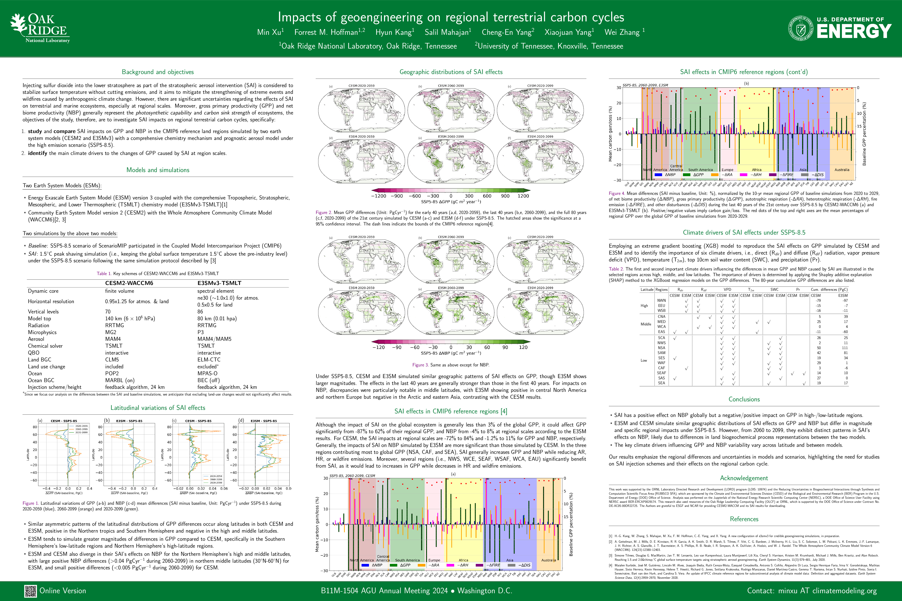

__Under Construction__ :construction_site:

{.on-glb width="30%" align="left" data-title="AGU fall meeting 2015" data-description="A canopy air space model implemented in CESM" }

{ .on-glb width="30%" align="left" data-title="CESM Workshop 2016" data-description="A canopy air space model implemented in CESM"}

{ .on-glb width="30%" align="left" data-title="AGU fall meeting 2017" data-description="ENSO impacts on Ecosystem"}

{ .on-glb width="30%" data-title="AGU fall meeting 2019" data-description="Porting SOCRATES and CASIM to GPU computing" }

{ .on-glb width="30%" data-title="AGU fall meeting 2024" data-description="Regional impacts of SAI on terrestrial carbon cycles" }

